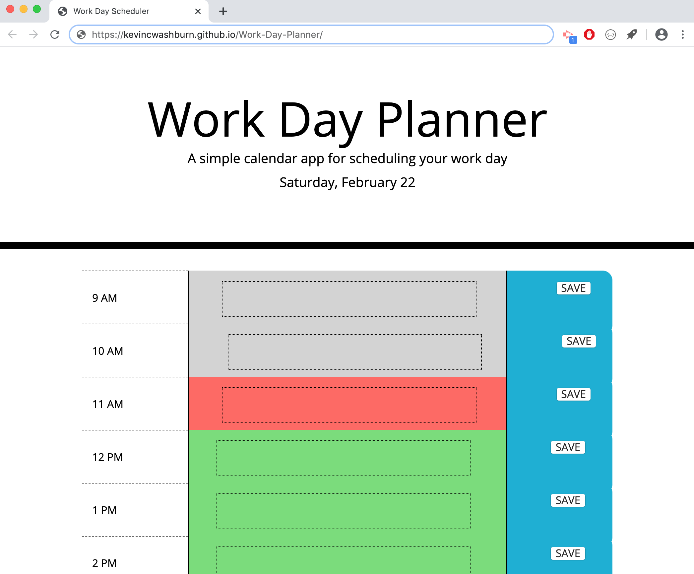

# Work-Day-Planner

This repository contains a web-based work-day planner. The date in the title is dynamically updated based on the current date. The hour blocks within the planner itself are color-coded and dynamically upadated as well based on the hour of the day. All hours that have already passed are colored gray, the current hour is colored red, and the future hour blocks are colored green.

Once the user enters text in the desired row, they can save it to local storage by clicking on the 'save' button on the right hand side of that hour block row. When the page refreshes, their text appears in the respective row.

Link to Deployed Site:
https://kevincwashburn.github.io/Work-Day-Planner/

Screenshot:

